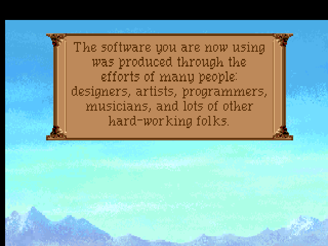
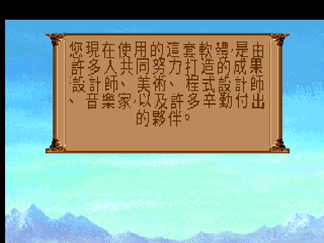
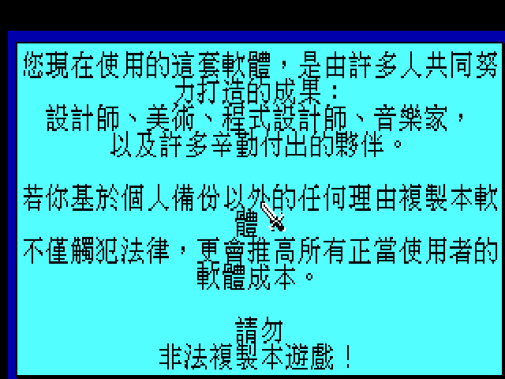

# 英雄傳奇 I:So You Want to Be a Hero — 繁體中文化(ScummVM / SCI)

> 史畢柏格山谷被詛咒了。男爵的一雙兒女不見蹤影,山賊盤據要塞,女巫芭芭雅嘎的小屋踩著雞腳在森林裡遊蕩。
> 而你,一個剛從「英雄函授學校」畢業、連劍都還握不太穩的年輕人,推開了「馱死鸚鵡客棧」的門——
> **「所以…你想當個英雄?」**

這是 Sierra 1989 年經典《Hero's Quest》(後改名 *Quest for Glory I*)的**繁體中文化**專案,**EGA 原版 + VGA 重製版都做**,中文化以 **ScummVM patch** 形式交付,不散布原遊戲資源。

三十多年前,這款遊戲在台灣以《英雄傳奇 I》之名進了書局的軟體架,厚厚的說明書、精訊/第三波的中文包裝盒、封面那條血紅色的巨龍。但遊戲本體,始終是英文的。**這個 repo,就是讓那個推開客棧大門的年輕人,終於能用母語聽懂整座山谷的故事。**

---

## 目錄

- [這是什麼遊戲](#game)
- [Hero's Quest 還是 Quest for Glory?](#rename)
- [三種英雄,三種玩法](#classes)
- [你不是「升級」,你是「練功」](#skills)
- [中文化專案](#cht)
- [技術文件索引](#docs)
- [交付原則](#delivery)

## 🐉 這是什麼遊戲

先講一件事:1989 年,還沒有人知道「動作角色扮演冒險解謎」這種四不像該怎麼分類。

那個年代的 Sierra,是 Roberta Williams 的圖形冒險(國王密使)當家;RPG 是另一個世界的事(創世紀、巫術)。直到 **Lori 與 Corey Cole 這對夫妻檔**端出《Hero's Quest》——它把 Sierra 的滑鼠點選冒險介面,硬生生塞進了一整套 RPG 的屬性、技能、戰鬥與經驗值系統。你可以像玩冒險遊戲那樣解謎,也可以像玩 RPG 那樣練等、打怪、學法術。**這個「冒險 × RPG」的混血公式,後來養活了整整五代作品**,也讓「英雄傳奇」成了一整個世代玩家心裡的白月光。

故事發生在 **史畢柏格山谷(Valley of Spielburg)**。這座本來平靜的德式山谷,被女巫 **芭芭雅嘎(Baba Yaga)** 下了詛咒:男爵的兒子被綁、女兒失蹤、山賊(brigands)佔據了要塞四處劫掠,連精靈與樹精都躲了起來。你——一個菜鳥冒險者——晃進這座山谷,接下公會佈告欄上那張「徵求英雄」的告示,一步步從跑腿打雜,走到直面山谷核心的黑暗。

沿路你會遇到:住在會走路小屋裡的女巫芭芭雅嘎、她那個只會惹麻煩的弄臣 **尤瑞克(Yorick)**、開藥鋪的、賣飛毯的貓臉商人卡塔族、草原上的半人馬,還有一位早已逝去、卻把整片草原變成「安寧之地」的善良女法師 **伊瑞娜(Erana)**。這座山谷的每一寸,都藏著 Cole 夫婦招牌的**冷笑話與雙關梗**——連你被打死的死法訊息,都要幽你一默(「被程式蟲咬死」「過勞而死」)。

> 這不是一款「打贏魔王」的遊戲。它是一款讓你**成為英雄**的遊戲——差別在於,英雄不只會打架。

## 📜 Hero's Quest 還是 Quest for Glory?

老玩家會記得一件糊塗帳:同一款遊戲,怎麼有兩個名字?

1989 年首發時,它叫 **《Hero's Quest: So You Want to Be a Hero》**(EGA,16 色)。結果桌遊大廠 Milton Bradley 早就註冊了「HeroQuest」商標,Sierra 只好把系列改名為 **《Quest for Glory》**。1992 年推出 **256 色 VGA 重製版**時,名字已經正式換成 *Quest for Glory I*,連介面都從打字指令進化成滑鼠圖示。

於是就有了這個中文化專案必須面對的分裂:

| 版本 | 年份 | 原名 | 引擎 | 畫面 | 台灣譯名 |
|---|---|---|---|---|---|
| **EGA** | 1989 | *Hero's Quest* | Sierra SCI0 | 16 色 320×200 | 英雄傳奇 I |
| **VGA** | 1992 | *Quest for Glory I* | Sierra SCI1.1 | 256 色 320×200 | 英雄傳奇 I |

兩版劇情相同,但**畫面、介面、文字資源格式全然不同**。EGA 版古樸、字是系統點陣字;VGA 版華麗、連屬性表都畫成一張羊皮紙美術圖。這個專案**兩版都做**——因為對老玩家來說,少了哪一個都不算完整。(封面盒上那個血紅巨龍與 `英雄傳奇 I` 燙金字,正是當年書局架上的那一版。)

## ⚔️ 三種英雄,三種玩法

《英雄傳奇》最迷人的設計,是它不逼你當同一種英雄。開場你會站在三尊石像前,選擇你的職業——**而這個選擇會徹底改變你的遊戲**:同一道門,戰士破門而入、法師用開鎖術、盜賊撬鎖潛入,三條路各走各的。

| 職業 | 英文 | 招牌解法 | 玩起來像 |
|---|---|---|---|
| **戰士** | Fighter | 正面硬幹、劍與拳、招架閃避 | 拳拳到肉的動作派 |
| **法師** | Magic User | 火焰鏢、開啟術、偵測魔法、鎮定術 | 資源管理的智力派 |
| **盜賊** | Thief | 開鎖、扒竊、潛行、夜半行動 | 步步為營的陰影派 |

選戰士,你會在鬥技場跟人拳腳相向;選法師,你得精打細算每一點法力,把法術當鑰匙用;選盜賊,你會在午夜摸黑潛進商店,享受那種「不被發現」的心跳。**三種職業各有專屬謎題、專屬結局細節**——這也是為什麼當年的玩家,一款遊戲要反覆玩三輪。

> 更狂的是:你在一代練成的這個英雄,**可以帶著他的屬性與裝備,一路轉生到二代、三代、四代、五代**。三十年前,這是聞所未聞的設計。

## 📈 你不是「升級」,你是「練功」

《英雄傳奇》沒有傳統 RPG 那種「打怪 → 經驗值 → 升等」的公式。它用的是一套**「用進廢退」**的技能系統:你**越常使用某個技能,那個技能就越強**。

- 一直爬牆,攀爬(Climbing)就會漲。
- 一直丟石頭,投擲(Throwing)就會漲。
- 一直被打又一直招架,招架(Parry)與體質(Vitality)就會漲。

於是你會看到一種很好笑的畫面:玩家蹲在牆角對著一面牆反覆練爬、對著空地反覆丟飛鏢——**因為在史畢柏格,英雄是「練」出來的,不是「打」出來的**。這套屬性/技能表,在 VGA 版被畫成一張精緻的羊皮紙(力量、智力、敏捷、體質、幸運、魔法…),也是這次中文化在美術層面最硬的一塊骨頭(見下)。

---

## 🀄 中文化專案

> 引擎:ScummVM **SCI**(非 AGS)。技術路線 = 沿用 ScummVM SCI 引擎既有的韓文/日文 CJK 範式,新增一條**繁體中文(`ZH_TWN` + Big5)**渲染路徑,以**內容比對替換**的方式,在文字送進畫面前換成中文——不改壓縮、不動原始資源結構。

### 進度

- [x] **M1** 引擎端到端打通:`ZH_TWN`+Big5 分支 + TSV 內容替換,實機驗證
- [x] **M2 VGA 全文字**:4521 則抽字,**4480 則已翻(99%)**;古風明體(AR PL UMing TW 15px)
- [x] **M3 EGA 全文字**:3883+ 則,**99%**(含 `script.*` 內嵌選單/死亡訊息/對白;1561 則沿用 VGA 共用文本)
- [x] **路線 A 編碼器**:自製 SCI1.1 view/pic 解碼/編碼器(`tools/sci_view.py`),把烘進美術圖的英文標籤換成中文
- [ ] **VGA baked-art 重繪**:角色創建羊皮紙 pic 904 的 13 個屬性名 + view 802 的按鈕(進行中)
- [ ] **M4** 多平台打包交付

### 實機畫面

| | 英文原版 | 繁體中文化 |
|---|---|---|
| VGA 版權框 |  |  |
| EGA 版權框 | — |  |

### 兩版、兩種難關

EGA 與 VGA 雖是同一款遊戲,中文化卻踩到完全不同的雷:

- **EGA(SCI0)**:UI 陽春,連角色創建的屬性名都是**純文字**(SCI 系統字型畫的)——所以走一般文字管線就能翻,反而簡單。難的是 SCI0 的字串藏在腳本裡、且用硬換行排版,得逐一跳脫處理。
- **VGA(SCI1.1)**:UI 升級成華麗美術,角色創建的屬性名**被烘進了背景圖(pic 904)**,不是文字——文字管線碰不到。為此本專案自製了一套 **SCI1.1 view/pic 的解碼/編碼器**,把美術圖裡的英文標籤逐一挖掉、重繪成中文明體,再編回 ScummVM 能載入的 patch。這是整個專案最硬的一段逆向工程。

## 🔧 技術文件索引

| 文件 | 內容 |
|---|---|
| [docs/00-feasibility.md](docs/00-feasibility.md) | 可行性評估:版本確認、ScummVM SCI CJK 現況、技術路線 |
| [docs/10-terminology.md](docs/10-terminology.md) | 術語表 / 譯名對照(職業、屬性、人名、地名,史畢柏格歐系音譯) |
| [docs/20-engine-cjk-patch.md](docs/20-engine-cjk-patch.md) | 引擎繪字 patch:`GfxFontChinese` + `ZH_TWN` 分支 + TSV 內容替換 |
| [docs/30-text-pipeline.md](docs/30-text-pipeline.md) | 文字抽取 → 翻譯(TSV)→ Big5 字型烘製流程 |
| [docs/40-baked-art-ui.md](docs/40-baked-art-ui.md) | baked 美術字中文化:自製 SCI1.1 view/pic 解碼/編碼器 |
| [WORKLIST.md](WORKLIST.md) | 工作交接 / 現況快照 / 踩雷筆記 |

**翻譯工作流**:`SCI_DUMP_RES` 抽字 → `extract_strings.py`(精確抽 key)→ 分批 → haiku subagent 翻譯 → `merge_translations.py`(保留 exact key)→ `build_cht.py`(NORMALIZE 修非 Big5 + 全形標點正規化 + 烘明體)→ `dist/`。

## 📦 交付原則

- 中文化**僅放 ScummVM patch**(散裝 patch 資源 + 繁中字型資料 + ScummVM 引擎修改 + view/pic patch),原遊戲資源不入庫、不散布。
- **完整性優先**:EGA / VGA 兩版都要交付(retro 完整性原則)。
- 啟用:ScummVM 以 `--language=tw` 執行(語言代碼是 `tw`,不是 `zh_TW`)。

## 致謝與相關專案

- 向 **Lori 與 Corey Cole** 致敬——是他們讓「當英雄」變成一件需要智慧、勇氣與一點幽默感的事。
- 當年把《英雄傳奇 I》引進台灣書局的中文包裝與厚說明書(珍藏系列),是這一代玩家的共同記憶。
- 姊妹作:英雄傳奇 II《烈火神兵》繁中化(AGS 引擎,不同技術路線):<https://github.com/wicanr2/quest-of-glory-ii-cht>
