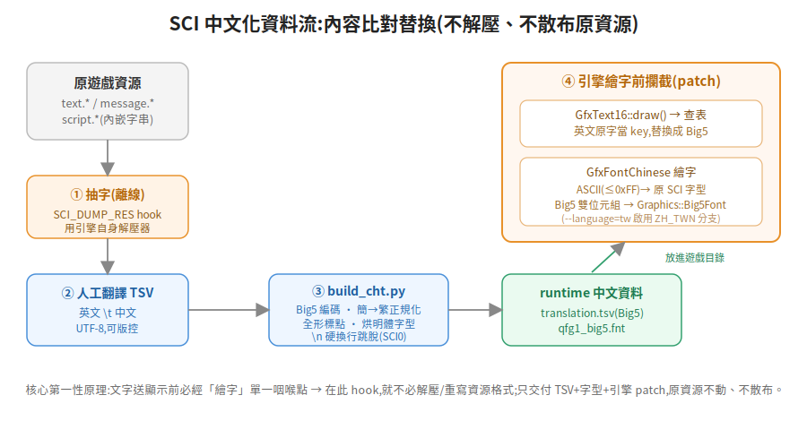
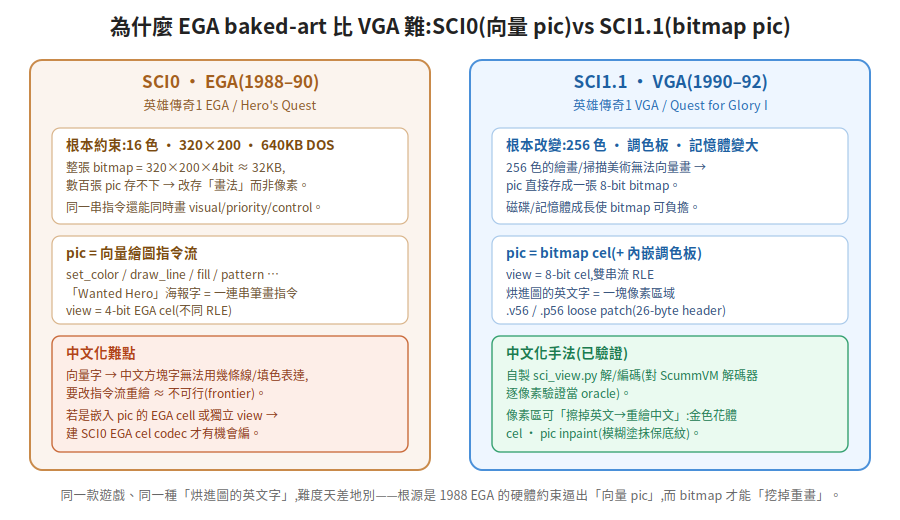

# ScummVM SCI 老遊戲繁體中文化 —— 第一性原理方法論

> 一句話:**在引擎「繪字」那個單一咽喉點做內容比對替換,就能不解壓、不散布原資源地把 Sierra SCI 遊戲中文化;真正難的不是文字,是烘進美術圖裡的英文——而 SCI0(EGA)與 SCI1.1(VGA)因當年硬體約束不同,美術格式天差地別。**
>
> 本文從「要解決什麼根本問題」推導每個設計,素材來自《英雄傳奇 I》(Hero's Quest / Quest for Glory I)EGA+VGA 雙版中文化的完整實作。相關細節文件:[20-引擎 CJK patch](20-engine-cjk-patch.md)、[30-文字管線](30-text-pipeline.md)、[40-baked-art](40-baked-art-ui.md)。

---

## 1. 根本問題:老遊戲為什麼不能直接中文化

一款 1990 年的 DOS 遊戲,骨子裡沒有一絲 CJK 的概念。要中文化,得同時解決三個彼此獨立的根本問題,外加一條硬約束:

| # | 根本問題 | 為什麼存在 |
|---|---|---|
| A | 引擎**畫不出**中文字 | 它只有一套 8-bit 拉丁點陣字型,沒有漢字字模、沒有雙位元組概念 |
| B | 中文字**進不了**顯示路徑 | 對白硬存在資源檔裡,是壓縮過的英文位元組 |
| C | 部分英文**烘進了美術圖** | 標題、海報、選單、屬性表的字是「畫」上去的,不是文字 |
| 約束 | **不得散布原遊戲資源** | 版權;交付物只能是「中文化 patch」,玩家自備正版 |

這四點決定了整套方法的形狀。下面逐一從根本推導。

---

## 2. 為什麼是「內容比對替換」,而不是解壓回填

直覺做法是:解壓 SCI 資源 → 把英文換成中文 → 重新壓縮塞回。這條路有兩個致命問題:

1. **要逆向並重寫整個資源格式**(壓縮、索引、對齊),任何一個位元組錯就整包壞;
2. **產物是「改過的原遊戲資源」**,散布它就是散布原作內容,踩約束。

第一性原理的翻轉:**不管資源長怎樣,對白文字最後一定會流經「繪字函式」這唯一咽喉點,就在送上螢幕的前一刻。** 那就在這裡 hook——

- 攔 `GfxText16` 的繪字入口,拿**英文原字當 key** 去查一張外部對照表(`translation.tsv`,`英文\t中文`),命中就換成中文再畫。
- 於是**完全不必碰資源格式**;交付物縮到只剩一張 TSV + 一個字型檔 + 一份引擎 patch,原資源一個位元組都不動、不入庫。

這就是「內容比對替換(content-keyed replacement)」。代價是每次繪字多一次查表(可忽略),換來的是「不解壓、不散布、格式無關」。

> **柵欄原則提醒**:SCI 把文字藏在壓縮資源裡不是找麻煩,是 1990 年的磁碟/記憶體約束。理解了這點,就知道「繞過格式」比「征服格式」划算。

---

## 3. 繪字路徑:如何讓引擎畫出中文

抽字換成中文只解決了問題 B,問題 A(畫不出漢字)要在引擎端補一條 CJK 繪字路徑。第一性原理是**最小新增、最大復用**:ScummVM 為了韓/日/中版早就內建了 `Graphics::Big5Font`(Big5 漢字點陣繪字),直接站在它肩膀上。

作法(`ZH_TWN` 語言分支,以 `--language=tw` 啟用):

- 新增一個 `GfxFontChinese`,包住原本的 SCI 字型:
  - 單位元組(`chr ≤ 0xFF`)→ **委派原 SCI 字型**畫(ASCII、標點照舊);
  - 雙位元組(Big5 首位元組 `0x81–0xFE`)→ 交給 `Graphics::Big5Font` 畫漢字。
- 在字型快取(`cache.cpp getFont()`)裡,`ZH_TWN` 時把每個 font 換成 `GfxFontChinese`。

為什麼用 **Big5** 而非 UTF-8:因為要復用的 `Big5Font` 吃 Big5,且雙位元組首位元組落在 `0x81–0xFE`、與 ASCII 不衝突,單一位元組流就能混排中英,繪字端一個 `if` 就分流。

字型本身用 `build_cht.py` 從開源明體(AR PL UMing)烘成 `qfg1_big5.fnt`——只烘譯文實際用到的字,檔案小。

---

## 4. 文字管線:從抽字到 runtime

問題 B 的完整流程(細節見 [30-text-pipeline](30-text-pipeline.md)):

1. **抽字**(離線一次):引擎加 `SCI_DUMP_RES` hook,用**引擎自身的解壓器**把 `text.*` / `message.*` / `script.*`(內嵌字串)dump 出來——不必自己寫解壓器。
2. **翻譯**:人工維護 UTF-8 的 `translation.tsv`(`英文\t中文`),可版控、可 diff、可分批派 subagent。
3. **`build_cht.py`**:UTF-8 → Big5 runtime + 烘字型。這一步做四件正確性把關:
   - **Big5 編碼**;非 Big5 字(常見於簡體來源)做**簡→繁正規化**對照;
   - **全形標點正規化**(半形標點會走 ASCII 小字型,難看);
   - **`\n` 硬換行跳脫**(SCI0 專屬,見下);
   - 烘明體 `qfg1_big5.fnt`。
4. **部署**:把 `translation.tsv` + `qfg1_big5.fnt` 放進遊戲目錄,`--language=tw` 啟動即生效。

### SCI0 專屬的文字踩雷

- **硬換行**:SCI1.1 會自動折行,SCI0 不會——EGA 對白用字面 `\n` 排版。譯文必須保留/跳脫 `\n`,引擎端 `unescapeCht` 還原,否則整段擠成一行或溢出。
- **字串散在 script.***:除了 `text.*`/`message.*`,SCI0 有對白/選單字串直接內嵌在 `script.*`,要另外掃(濾掉 SCI 符號名、CamelCase 類別名、bytecode 垃圾)。
- **parser 指令不可翻**:SCI0 是文字 parser 遊戲,像 `look`、`open door`、`hut of brown, now sit down`(芭芭雅嘎小屋咒語)這種**玩家要輸入的指令字串絕不能翻**,翻了 parser 就比對不到。判斷準則:玩家「看到」的翻,玩家「打字輸入」的留原文。

---

## 5. 難點所在:baked-art,與 SCI0/SCI1.1 的分水嶺

問題 C(烘進圖的英文)才是真正的硬骨頭,而且**同一款遊戲的 EGA 版和 VGA 版難度天差地別**。根源是當年硬體約束逼出了兩種完全不同的美術資源格式。

### 第一性原理:為什麼 SCI0 pic 是「向量」、SCI1.1 是「bitmap」

- **SCI0(1988–90,EGA)**:16 色、320×200、DOS 640KB。一張全畫面 bitmap = 320×200×4bit ≈ 32KB,數百張 pic 根本存不下。於是 pic **不存像素,存「畫法」**——一串向量繪圖指令(設色、畫線、填色、貼圖樣)。這不只省空間,同一串指令還能一次畫出 visual/priority/control 三層。view 則是 4-bit EGA cel。
- **SCI1.1(1990–92,VGA)**:256 色 + 調色板。256 色的繪畫/掃描美術**無法**用幾條線畫出來(它是畫的/掃的),只能存成一張 8-bit bitmap;而此時磁碟/記憶體也長大到負擔得起。view 是 8-bit cel、雙串流 RLE、內嵌調色板。

### 這如何決定中文化難度

- **VGA(bitmap)= 可做,已驗證**:烘進圖的英文字就是「一塊像素」,可以**擦掉英文、重繪中文**。本專案自製 `tools/sci_view.py` 解/編碼 SCI1.1 view(`.v56`)/pic(`.p56`),對 ScummVM 自身解碼器**逐像素驗證當 oracle**,再把角色創建屬性表、主選單海報、職業選擇、標題、credits 全部重繪成中文(手法:金色花體 cel、pic inpaint 模糊塗抹保底紋)。
- **EGA(向量)= frontier,可能不可行**:如果海報字是 pic 的**向量筆畫**畫出來的,中文方塊字無法用幾條線/填色表達,要改指令流重繪 ≈ 不可行。只有當英文是「嵌在 pic 裡的 EGA cell」或「獨立 view cel」時,才可能靠自製 SCI0 EGA cel codec 去編輯。**這一塊本專案尚在釐清中(view vs 向量 pic 的判定決定可行性)**。

> 這就是為什麼「EGA 也一併中文化」聽起來理所當然,做起來卻是另一個量級的逆向工程——不是偷懶,是格式的本質難度。

---

## 6. 建置與打包踩雷(SCI patch 交付)

- **編譯全走 docker**;ScummVM `configure` 順序硬規則:`--disable-all-engines` 必須在 `--enable-engine=sci` **之前**(反了 SCI 被關)。
- **交叉編譯**:Windows 走 mingw-w64(自帶 SDL2+zlib);macOS **無法**在 Linux 交叉編譯(Apple SDK 授權),改 GitHub Actions `macos-14` runner **自編 pinned SDL2**(不要 brew 的 sdl2-compat shim)、per-arch build + `lipo` 出 universal。
- **macOS 精簡連結**:`scummvm-static` 對每個外部庫要 MacPorts 式靜態 `.a`,runner 沒有且 brew 的 `.a` 是 arm64-only(x86_64 弧會架構不符)→ **明確 `--disable` 掉所有外部媒體/格式/網路庫 + TTS/taskbar/dialogs**,只留自編 universal SDL2 + 內建 nuked-opl(AdLib 音樂)+ 內建 Big5Font。細節見 [../BUILD.md](../BUILD.md)。
- **交付原則(硬)**:只放 patch(引擎改動 + Big5 runtime + view/pic patch),原遊戲資源不入庫、不上 Release;完整可玩包(含遊戲)僅本機保存。

---

## 7. 可複用清單(換一款 SCI 遊戲時)

1. 引擎端加 `ZH_TWN` + `GfxFontChinese` + `GfxText16` 查表 hook(幾乎照搬)。
2. `SCI_DUMP_RES` 抽字 → TSV → `build_cht.py`(Big5/正規化/全形/`\n`)。
3. 判定版本:**SCI0(EGA)還是 SCI1.1(VGA)**——決定 baked-art 可行性與工具。
4. VGA:`sci_view.py` 解/編 view/pic,逐像素對 ScummVM oracle 驗證後重繪。
5. EGA:先判 baked 英文在 view(可能可編)還是向量 pic(可能不可行),再決定投入。
6. 多平台打包按 §6;交付只放 patch。

> 與 kb 的互補:AGOS/talkie 老遊戲中文化見 `rulebook/84`;非 ScummVM 的乾淨重寫路線見 kb `retro-game-remake`。本篇專講 **ScummVM SCI 引擎內**的 patch 式中文化。
